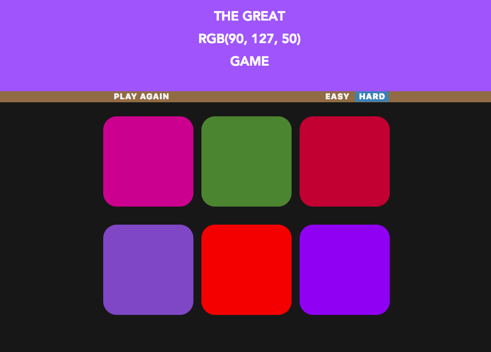
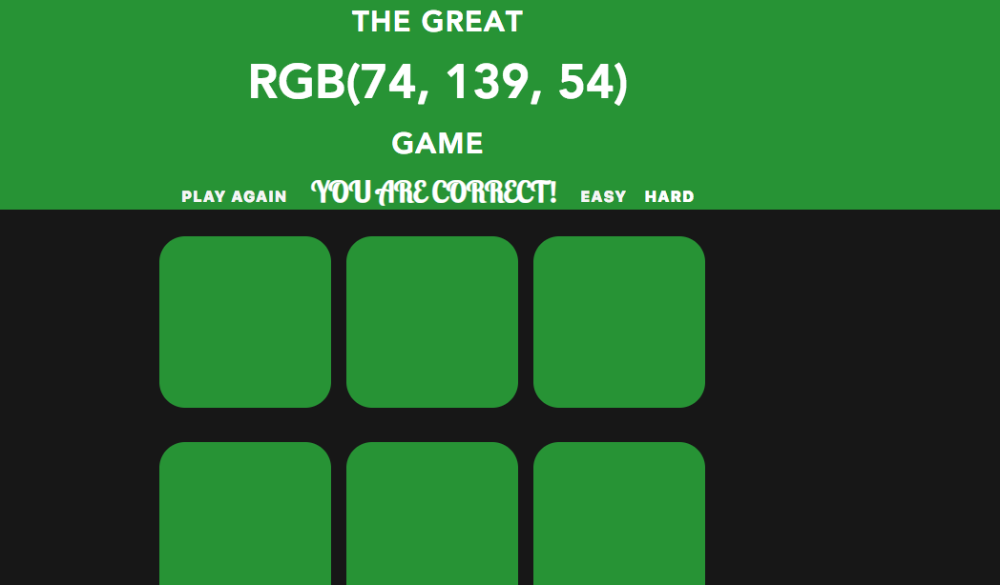
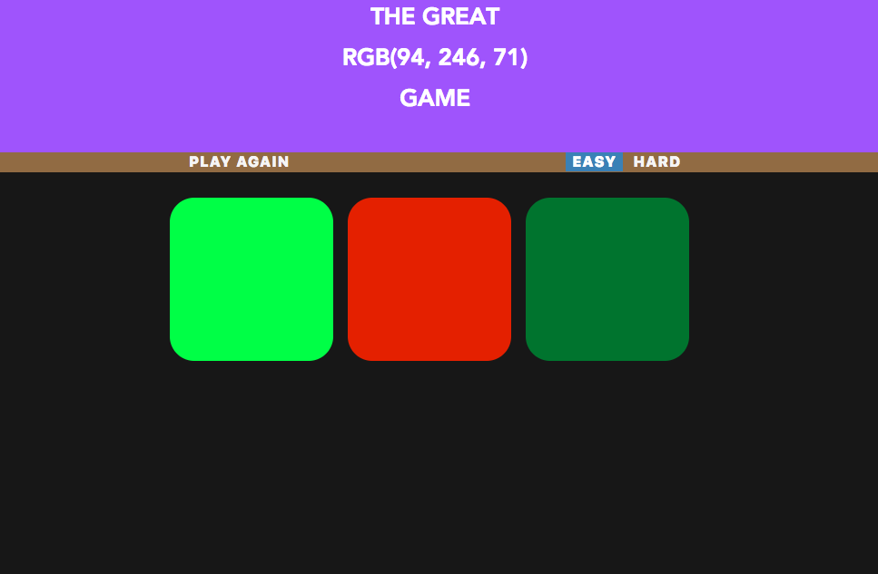
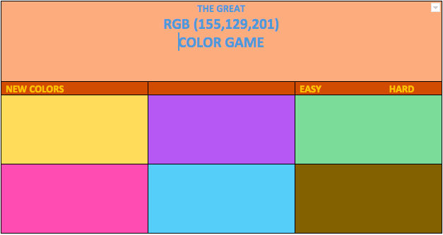

# Project One - Color Game

A game where one player can guess the correct color square among the 6 squares given according to RGB color code given at the top of the page. 

<!-- Rules of the games-->

<!-- Screenshots of game go here -->

<!-- Screenshots of wireframe -->

![Screen Shot of Game]
![Screen Shot of Game]

<!-- Technologies used-->

- Html
- JavaScript
- CSS

<!-- Getting started -->

here is a link to my game. 
[rgb Color Guessing Game](https://fagleyali.github.io/Project-One/ "rgb Color Guessing Game")
<!--Instructions-->
1. First you have to guess what color is matched with the given rgb color code.
2. Then you have to click the guessed square area.
3. If is correct one, then banner and all squares will be of that color and you get a message like "You are Correct!".
4. if it is not correct, then the clicked square will be vanished.

<!-- Next Steps -->
In the next version, I will add some animations and sounds to make more interesting. 

